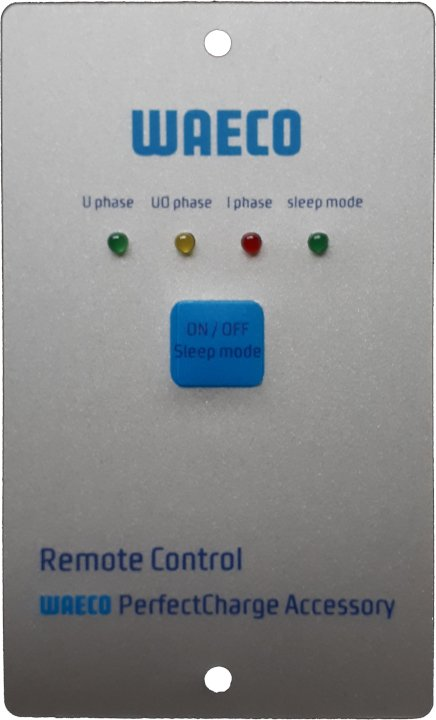
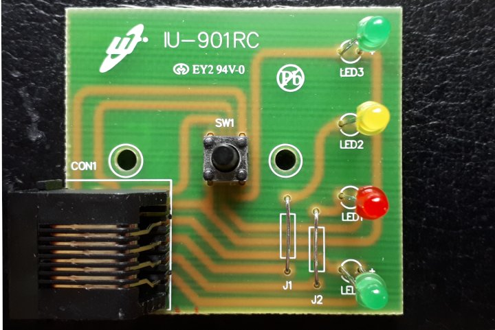
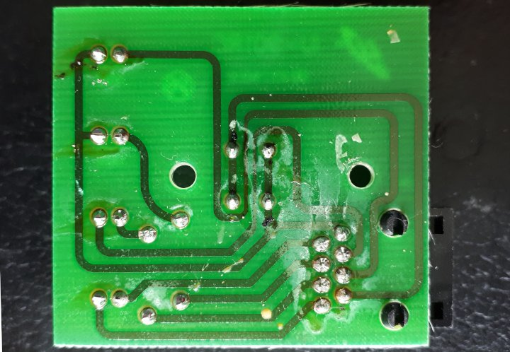
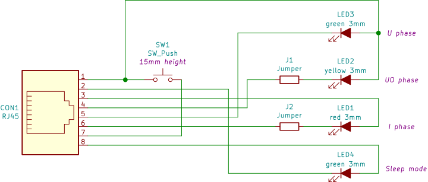
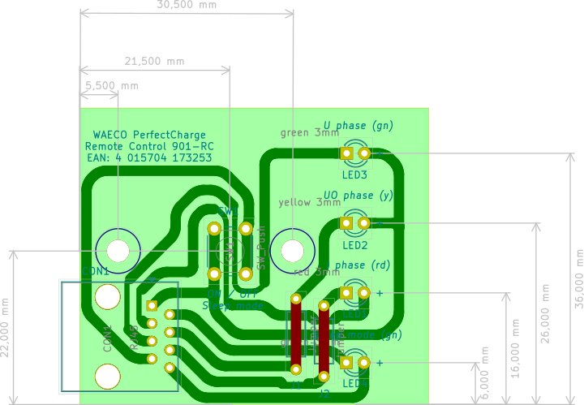

# perfectcharge_remote
Reverse engineering of the Waeco PerfectCharge remote controller.

The remote controller for the Waeco PerfectCharge line of marine battery chargers is a really simple device consisting of no more than a pushbutton switch and some leds.

PCB is single layer with two jumper wires on top side.

Schematic and PCB as been recreated in KiCAD:

KiCAD design files and manufacturing files (Gerber, Excellon drill) can be found in repository.

